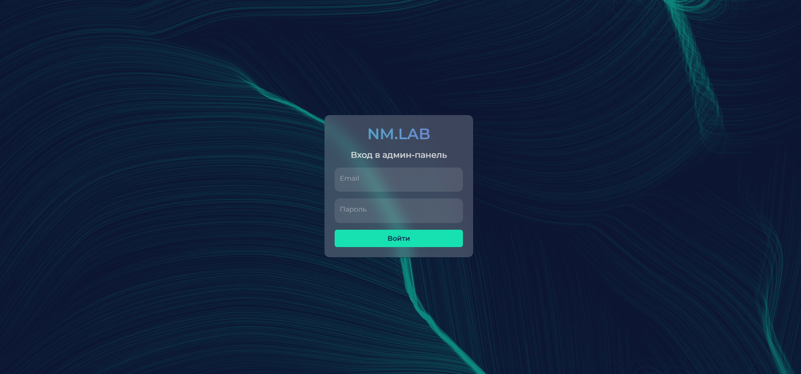
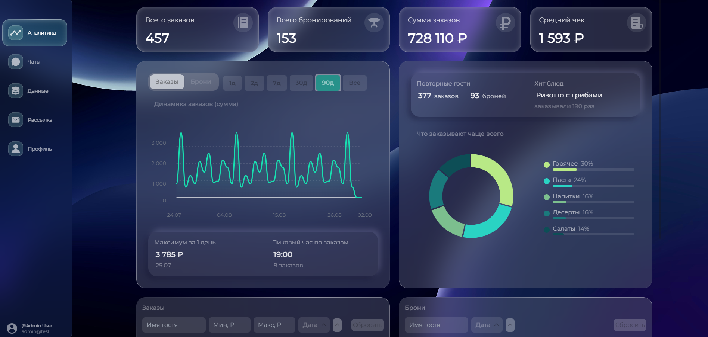
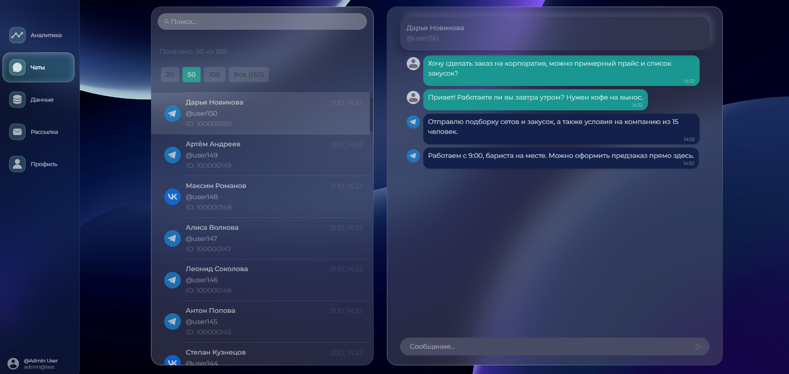
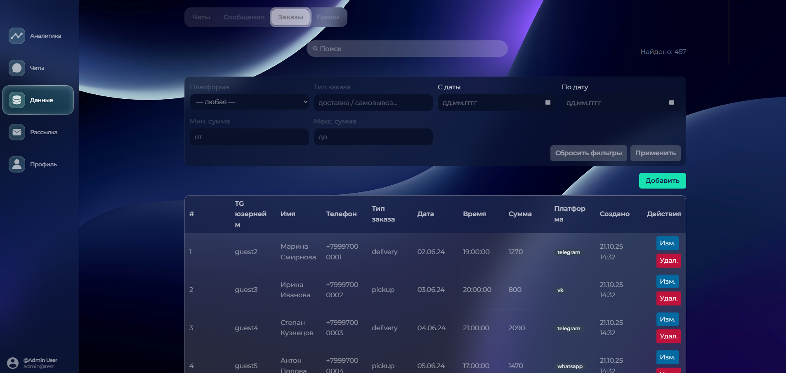
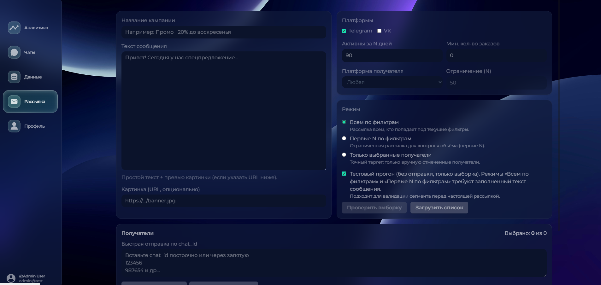

# SaaS-interface

Админ-панель для Telegram-бота, объединяющая управление рассылками, чатами, заказами и бронированиями. Проект состоит из интерфейса на React и серверной части на Express, разворачивается локально через Docker или набор npm-команд.

---

## Взгляд на функциональность

- Аналитика: метрики по заказам, динамика сообщений, визуализации (круговые/линейные графики).
- Чаты: переписка с пользователями Telegram, быстрые ответы.
- База данных: просмотр и редактирование сущностей (chats, messages, orders, reservations).
- Рассылки: создание кампаний, сегментация получателей, отслеживание статуса отправки.
- Профиль администратора: управление учетными данными.
- Авторизация: JWT-аутентификация.

---

## Технологический стек

**Frontend**

- React 19 + React Router 7
- TypeScript
- Vite 7 (Dev/Build pipeline)
- TailwindCSS 3 + PostCSS + Autoprefixer
- Axios для общения с API
- Framer Motion для анимаций

**Backend**

- Node.js + TypeScript
- Express 5 (REST API)
- PostgreSQL 16 (через `pg`)
- JWT-аутентификация (`jsonwebtoken`, `bcryptjs`)
- Рассылки для Telegram (`node-telegram-bot-api`, `telegraf`)
- Парсинг CSV (`csv-parser`), обработка дат (Day.js, Luxon)
- Config & tooling: `dotenv`, `dotenv-flow`, `ts-node-dev`, `cross-env`

**Инфраструктура и инструменты**

- Docker Compose (контейнеризация фронтенда, бэкенда и PostgreSQL)
- ESLint 9 (анализ кода фронтенда и бэкенда)
- EditorConfig, Prettier-конфигурация (через `.prettierrc`)
- GitHub Actions (`.github/workflows/ci.yml`) для CI

---

## Структура репозитория

```text
.
├─ frontend/               # клиентская часть (React + Vite + TailwindCSS)
│  ├─ src/
│  └─ Dockerfile
├─ backend/                # сервер (Express + PostgreSQL)
│  ├─ config/
│  ├─ controllers/
│  ├─ db/init/             # SQL-скрипты для схемы и сидов
│  ├─ middlewares/
│  ├─ routes/
│  ├─ services/
│  ├─ types/
│  ├─ utils/
│
│  └─ Dockerfile
├─ docker-compose.yml      # db + backend + frontend
├─ README.md
└─ LICENSE
```

---

## Скриншоты интерфейса

Скриншоты хранятся в каталоге `docs/screenshots/`

- ### Экран входа
  
- ### Аналитика
  
- ### Чаты
  
- ### База данных
  
- ### Рассылки
  

---

## Messaging: сценарии, UX и интеграция бота

Документ `frontend/docs/messaging.md` содержит:

- пошаговое подключение бота и требования к интеграции.

[Читать → frontend/docs/messaging.md](frontend/docs/messaging.md)

---

## Быстрый старт через Docker

1. Установите Docker Desktop и Git.
2. Клонируйте репозиторий:
   ```bash
   git clone https://github.com/AnatolyNeminushy/admin-panel-2.0
   cd admin-panel-2.0
   ```
3. Поднимите сервисы:
   ```bash
   docker compose up -d
   ```
4. Что поднимется:
   - **db** (PostgreSQL) — порт в контейнере `5432`, на хосте `5433`.
   - **backend** (Express API) — `http://localhost:5000`.
   - **frontend** (React) — `http://localhost:3000` (через nginx внутри контейнера).
5. При первом запуске выполняются SQL-скрипты в `backend/db/init/` — создаются таблицы и заливаются тестовые данные.

Логи:

```bash
docker compose logs -f
docker compose logs -f backend
docker compose logs -f db
```

Перезапуск с очисткой данных:

```bash
docker compose down -v
docker compose up -d
```

---

## Локальная разработка без Docker

### Frontend

```bash
cd frontend
npm install
npm run dev    # http://localhost:5173
```

Сконфигурируйте `frontend/.env.development` или используйте `VITE_API_URL` по умолчанию (`http://localhost:5000/api`).

### Backend

```bash
cd backend
npm install
cp .env.example .env.development
npm run dev    # http://localhost:5000
```

Перед запуском убедитесь, что PostgreSQL доступен локально, или обновите `DATABASE_URL` в `.env.development`.

### Сборка

```bash
cd frontend && npm run build
cd backend && npm run build
```

---

## Переменные окружения

| Компонент | Ключ                        | Назначение                                               |
| --------- | --------------------------- | -------------------------------------------------------- |
| Backend   | `DATABASE_URL` / `PG*`      | Подключение к PostgreSQL.                                |
| Backend   | `JWT_SECRET`, `JWT_EXPIRES` | Настройки JWT.                                           |
| Backend   | `TELEGRAM_BOT_TOKEN`        | Токен бота для отправки сообщений.                       |
| Backend   | `OPENAI_API_KEY`            | Используется в сервисе аналитики/чатов при генерации.    |
| Backend   | `PORT`                      | Порт API (по умолчанию 5000).                            |
| Frontend  | `VITE_API_URL`              | Базовый URL API (например, `http://localhost:5000/api`). |

- Примеры смотрите в `backend/.env.example` и `frontend/.env.example`.

---

## Тестовые данные

После запуска seed-скриптов в базе доступны:

- `accounts`: `admin@test` (роль `admin`, пароль `admin123`).
- `chats`: тестовый Telegram-чат.
- `messages`: образцы входящих/исходящих сообщений.
- `orders`: пример заказа.
- `reservations`: пример бронирования.

Обновление пароля:

```bash
docker compose exec backend node utils/make-hash.js <ваш-пароль>
```

Скопируйте полученный bcrypt-хеш и обновите им поле `password_hash` нужной записи в таблице `accounts`.

---

## Полезные команды

| Область  | Команда             | Назначение                       |
| -------- | ------------------- | -------------------------------- |
| Frontend | `npm run dev`       | Запуск Vite dev-сервера.         |
| Frontend | `npm run build`     | Сборка в `dist/`.                |
| Frontend | `npm run preview`   | Превью production-сборки.        |
| Frontend | `npm run lint`      | ESLint.                          |
| Backend  | `npm run dev`       | Dev-сервер (`ts-node-dev`).      |
| Backend  | `npm run build`     | Компиляция TypeScript в `dist/`. |
| Backend  | `npm run start`     | Запуск production-сборки.        |
| Backend  | `npm run typecheck` | Проверка типов.                  |

---

## API в нескольких словах

- `GET /api/health/db` — проверка состояния БД.
- `GET /api/orders`, `GET /api/orders/:id`, `POST /api/orders` — управление заказами.
- `GET /api/reservations`, `GET /api/reservations/:id`, `POST /api/reservations` — работа с бронированиями.
- Маршруты для чатов, рассылок, аналитики и профиля доступны в папке `backend/routes/`.

Полная схема API описана в соответствующих контроллерах (`backend/controllers/`) и сервисах (`backend/services/`).

---

## Лицензия

Проект распространяется по лицензии MIT — см. файл `LICENSE`.

---
